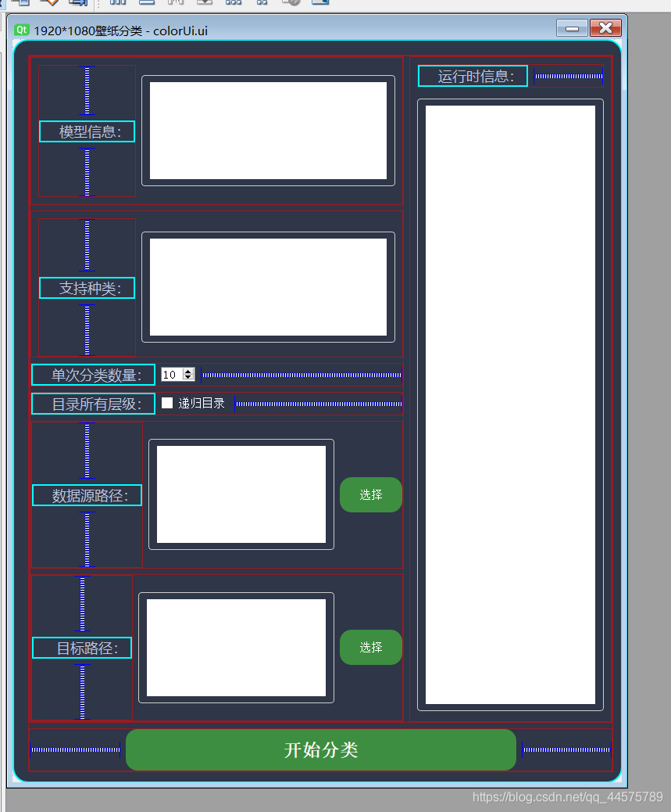
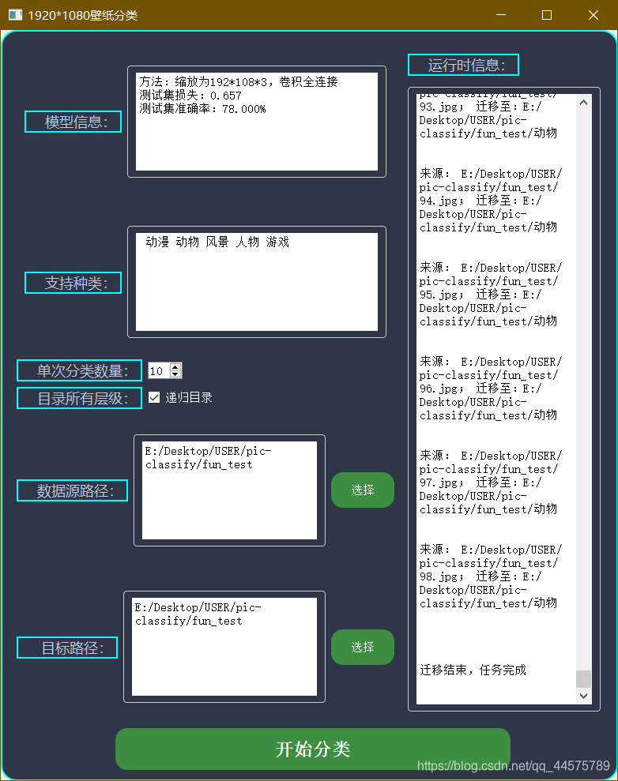

# 人工智能图片分类Python小程序

<!-- vscode-markdown-toc -->
* 1. [背景](#background)
* 2. [整体做法](#method)
  + 2.1. [项目需求](#demand)
  + 2.2. [实现思路](#thinking)
* 3. [项目说明](#explain)
  + 3.1. [项目结构](#structure)
  + 3.2. [源码说明](#src-explain)
    - 3.2.1. [数据集制作](#make-set)
    - 3.2.2. [模型的训练](#model)
    - 3.2.3. [数据集、已训练的模型地址](#source)
    - 3.2.4. [界面展示](#show)
* 4. [结语](#end)

##  1. <a name='background'></a>背景

**&ensp; &ensp; 个人小作业，虽说做的很差，也算是一个学习的转化；主要用于分类自己下载的壁纸。**
<br>

**&ensp; &ensp; 学期末需要一个学习成果的展示，高难度的自己做不来，模型也跑不动（电脑有点渣），刚好自己也有图片分类的需求，最后决定做了这个，确实也算做了一个自己用得到的小程序**

##  2. <a name='method'></a>整体做法

###  2.1. <a name='demand'></a>项目需求

**需要自动加载指定目录所有图片，自行迁移至指定目录并存入不同的文件夹**

###  2.2. <a name='thinking'></a>实现思路

1. 数据来源于各大壁纸网站，通过下载分类好的图片免去了自己手动分类的痛苦
2. 将图片进行微缩处理，将1920 $\times$ 1080的图片转化为192 $\times$ 108的尺寸，不然尺寸太大硬件吃不消。
3. 第二步可以将图片转化为单通道，数据量会小很多，但是测试过程中发现数据集较小时准确率比直接使用三通道要高一些，但是数据集大之后三通道的图片识别更加准确
4. 目前数据集是共10000多张图片共五个分类（差不多自己电脑的上限），通过第二步、第三步的三通道缩小处理后，所有数据集大小约600MB，还在接受范围内。
5. 模型的搭建与其他模型搭建基本一致

##  3. <a name='explain'></a>项目说明

###  3.1. <a name='structure'></a>项目结构

```text
│  colorUi.ui	正在使用的UI界面文件
│  fun.py		对于模型函数的初步封装，为PyQt界面提供支持
│  main.py		入口部分
│  model.py		模型的训练、加载
│  ui.py		正在使用的UI界面py文件
│  ui.ui		老的UI界面文件
│  utils.py		一些读取图片处理图片的函数
├─fun_test			内含各类图片共100张，用于最后的功能测试
├─make_data_set		用于处理制作数据集
├─model				训练好的模型存储的路径
├─test				内含处理好的数据集的测试集，存储格式是是numpy数组的序列化，三通道维度信息（N,108.,192,3）；标签一维数组
├─test_pic		测试集原始数据目录，路径下各种图片独占一个目录，用于通过make_data_set制作数据集，目录应与train_pic对应
│  ├─dongman	其中一个分类
│  ├─dongwu		其中一个分类
│  ├─fengjing	其中一个分类
│  ├─meinv		其中一个分类
│  └─youxi		其中一个分类
├─train			内含处理好的数据集的训练集，存储格式是是numpy数组的序列化，三通道维度信息（N,108.,192,3）；标签一维数组
└─train_pic
    ├─dongman	其中一个分类
    ├─dongwu	其中一个分类
    ├─fengjing	其中一个分类
    ├─meinv		其中一个分类
    └─youxi		其中一个分类
```

###  3.2. <a name='src-explain'></a>源码说明

####  3.2.1. <a name='make-set'></a>数据集制作

可将原始数据图片的训练数据和测试数据分别放置在 `train_pic` 和 `test_pic` ，执行 `make_data_set/make_data_set.py` 程序可生成所需的数据集格式，其中训练集和训练集标签会保存在 `train` 文件夹，测试集和测试集标签会保存在 `test` 文件夹。

####  3.2.2. <a name='model'></a>模型的训练

可取消注释 `model.py` 中的训练代码并执行 `model.py` 文件

```python
if __name__ == '__main__':
    model = getModel(True)
```

####  3.2.3. <a name='source'></a>数据集、已训练的模型地址

1. `train_pic.npy`和`train_labels.npy`放至`train`目录
2. `test_pic.npy`和`test_labels.npy`放至`test`目录
3. `780_3x3_1_3_100_expll.h5`为已训练好的模型，放至`model`目录
4. 百度网盘下载地址

```text
链接：https://pan.baidu.com/s/1kFhUuMqufeG356Dnaxf45g 
提取码：6666 
```

####  3.2.4. <a name='show'></a>界面展示

1. 界面设计



2. 运行界面



##  4. <a name='end'></a>结语

*$\qquad$虽说很简单，或许显得很那么······没用，但是也是自己的一个小成果，也算是又做了一个对自己有用的工具吧！*
